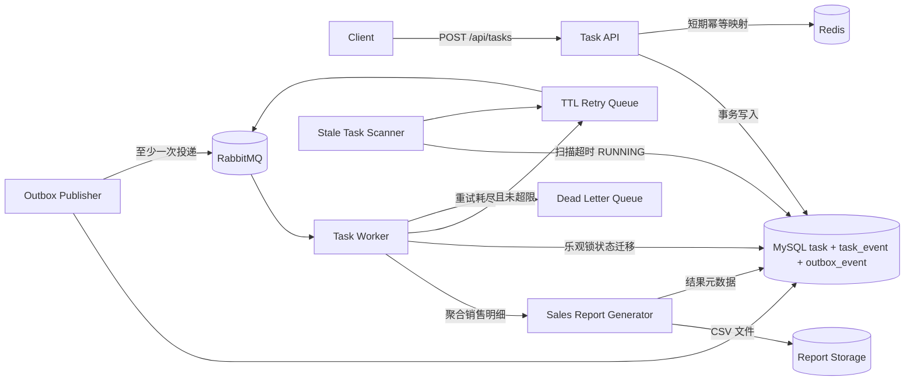
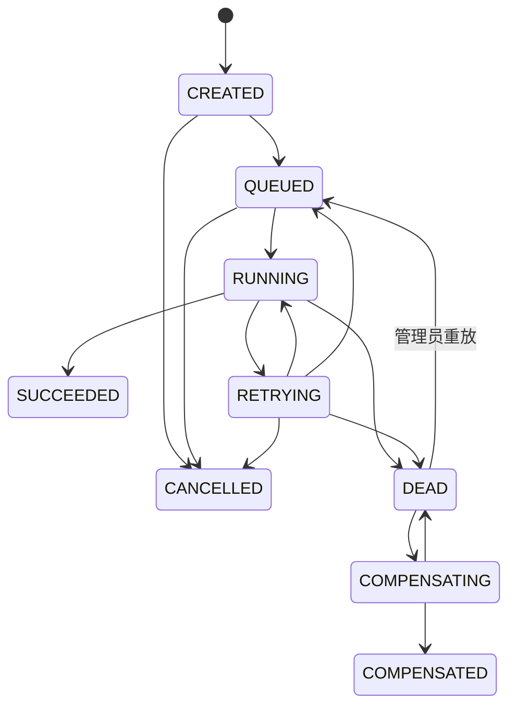

# 架构与一致性设计

## 主链路

API 与 Worker 当前打包为一个可部署 Spring Boot 进程，但代码边界分别位于 `api/service/messaging/report` 包，可通过 RabbitMQ 水平扩展 Worker。这样保留一键演示能力，也避免在第一版为拆进程引入重复配置；后续可把消费者包拆成独立部署模块而不改变消息契约。

## 报表业务闭环

`REPORT` 任务的 payload 包含报表名称、申请人和销售订单明细。Worker 按区域聚合订单数、商品数量和销售额，生成带总计行的 UTF-8 CSV，并在 `report_result` 中持久化源记录数、汇总行数、总数量、总金额、文件大小和 SHA-256。成功任务可以通过 `GET /api/tasks/{id}/result` 下载，非成功任务返回明确的 `REPORT_NOT_READY`。

文件使用 `taskId.csv` 作为内部存储键，避免客户端文件名造成路径穿越；写入时先落临时文件，再原子替换目标文件。相同消息重投时，终态拦截和 `report_result.task_id` 主键共同阻止重复业务结果。

## 一致性取舍

- RabbitMQ 提供至少一次投递，不宣称 exactly-once。
- `Idempotency-Key` 先映射到 Redis，Redis 异常时数据库 `idempotency_key` 唯一约束仍是最终权威。
- `task` 与 `outbox_event` 在同一数据库事务提交，MQ 暂时不可用时事件保持未发布，调度器恢复投递。
- 消费者先检查终态并使用 `version` 乐观锁，重复消息不会重复产生有效业务结果。
- 每次状态变化追加 `task_event`，非法迁移由状态机拒绝，便于 API、DB、MQ 多源核对。

## 状态机

